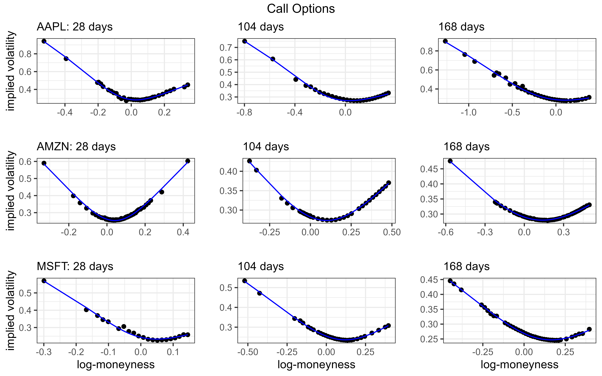

# directSVI
Direct Least-Squares Method for the Stochastic Volatility Inspired (SVI) equation for implied volatilities. The code is based on my working paper ["Direct Fit for SVI Implied Volatilities"](https://github.com/wol-fi/directSVI/blob/main/directSVI.pdf). Instead of non-linear multi-parameter optimization I propose a closed-form solution for fitting slices of implied volatility (strike domain) directly. 

## Examples:
Fitted SVI curve for mid- implied volatilities of different stocks (4/7/2023).

## Concept:
- the SVI equation can be fully linearized when re-writing it as a conic section (hyperbola)
- once linearized, the SVI equation represents a quadratically constrained Eigenvalue problem
- which is easily solved

## Code:
I'm planning to make the code available by summer 2023:
- [R](https://github.com/wol-fi/directSVI/tree/main/R)
- [Python](https://github.com/wol-fi/directSVI/tree/main/python)
- Matlab
